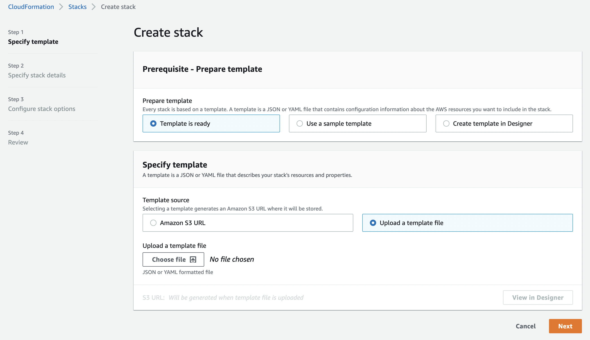

# CloudFormation Stacks

Når en template er blevet parsed af CloudFormation engine så er output et Change Set.

Et Change Set er en liste af ændringer som skal foretages i AWS.

Outputtet af et Change Set er en CloudFormation Stack.

## Forskellige måder at oprette en CloudFormation Stack

Vi prøver at kører denne simple template på via følgende måder:

- Via AWS Console (Manual)
- Via AWS CLI (Skriptet)
- Via AWS SDK (Programatisk)

```yaml
AWSTemplateFormatVersion: '2010-09-09'
Description: 'Simple stack'
Parameters:
  BucketName:
    Type: String
Resources:
  MyBucket:
    Type: 'AWS::S3::Bucket'
    Properties:
      BucketName: !Ref BucketName
```

### AWS Management Console oprettelse (Manuel)

Når man opretter en stack igennem konsollen starter man en wizard.



Lad os prøve at oprette en simpel stack vi laver et Change Set, reviewer det og kører Change Set på kontoen.

Demo: https://eu-west-1.console.aws.amazon.com/cloudformation/home?region=eu-west-1#/

### AWS CLI (Skriptet)

AWS CLI er et kommandolinje værktøj til at interagere med AWS.

AWS CLI er et open source projekt og kan downloades fra https://aws.amazon.com/cli/

Example på hvordan vi kan oprette den samme stack som vi lavede igennem konsollen.

```bash
aws cloudformation create-stack \
  --stack-name simple-stack-cli \
  --template-body file://./examples/simple-stack.yaml \
  --parameters BucketName=simple-bucket-cli
```

Tjek status på stacken og de resourcer vi har installeret.

```bash
aws cloudformation list-stack-resources --stack-name simple-stack-cli
```

### AWS SDK (Programatisk)

Vi kan også bruge et programming sprog til at oprette en stack.

I dette eksempel bruger vi Javascript.

```javascript
async function createStack(fileName) {
  const cfn = new AWS.CloudFormation({ region: 'eu-west-1' });
  const params = {
    StackName: 'simple-stack-sdk',
    TemplateURL: `https://s3-eu-west-1.amazonaws.com/${templateBucket}/${fileName}`,
    Parameters: [
      {
        ParameterKey: 'BucketName',
        ParameterValue: `simple-stack-sdk-${uuid()}`
      }
    ]
  };
  await cfn.createStack(params).promise();
}
```

[Se hele koden her](./examples/create-simple-stack.js)

### AWS CDK (Programatisk)

CDK står for Cloud Development Kit og er en måde at lave Infrastructure as Code med et programmeringssprog.

CDK genererer CloudFormation templates som så deployes til AWS igennem CloudFormations engine.

For at deploye en stack med CDK kan man fra et CDK projekt skrive:

```bash
cdk deploy
```

- https://docs.aws.amazon.com/cdk/v2/guide/home.html

## TEST

noget omkring stack låsning ved brug af import / export
drift detection?
