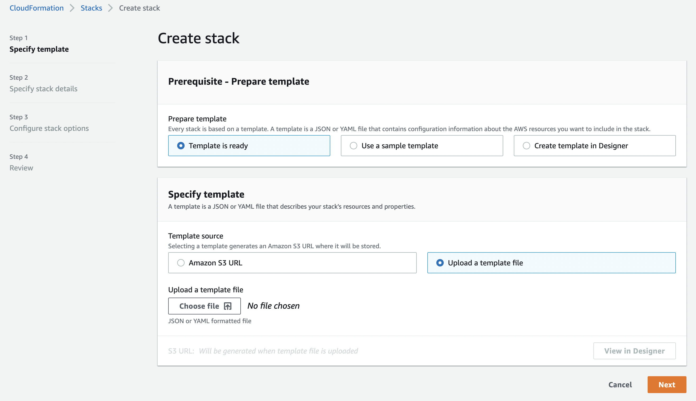
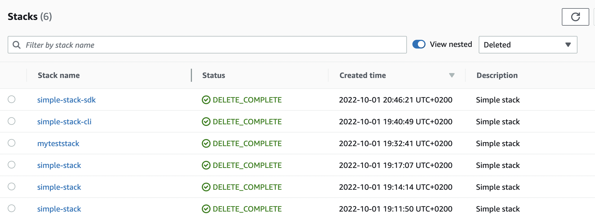

# CloudFormation Stacks

Når en template er blevet parsed af CloudFormation engine så er output et Change Set.

Et Change Set er en liste af ændringer som skal foretages i AWS.

Outputtet af et Change Set er en CloudFormation Stack.

## Stack oprettelse

Vi prøver at kører denne simple template på via følgende måder:

- Via AWS Console (Manual)
- Via AWS CLI (Skriptet)
- Via AWS SDK (Programatisk)

```yaml
AWSTemplateFormatVersion: '2010-09-09'
Description: 'Simple stack'
Parameters:
  BucketName:
    Type: String
Resources:
  MyBucket:
    Type: 'AWS::S3::Bucket'
    Properties:
      BucketName: !Ref BucketName
```

- https://docs.aws.amazon.com/AWSCloudFormation/latest/UserGuide/using-cfn-cli-creating-stack.html

### AWS Management Console oprettelse (Manuel)

Når man opretter en stack igennem konsollen starter man en wizard.



Lad os prøve at oprette en simpel stack vi laver et Change Set, reviewer det og kører Change Set på kontoen.

Demo: https://eu-west-1.console.aws.amazon.com/cloudformation/home?region=eu-west-1#/

### AWS CLI (Skriptet)

AWS CLI er et kommandolinje værktøj til at interagere med AWS.

AWS CLI er et open source projekt og kan downloades fra https://aws.amazon.com/cli/

Example på hvordan vi kan oprette den samme stack som vi lavede igennem konsollen.

```bash
aws cloudformation create-stack \
  --stack-name simple-stack-cli \
  --template-body file://./examples/simple-stack.yaml \
  --parameters ParameterKey=BucketName,ParameterValue=lb-workshow-simple-bucket-cli
```

Tjek status på stacken og de resourcer vi har installeret.

```bash
aws cloudformation list-stack-resources --stack-name simple-stack-cli
```

### AWS SDK (Programatisk)

Vi kan også bruge et programming sprog til at oprette en stack.

I dette eksempel bruger vi Javascript.

```javascript
async function createStack(fileName) {
  const cfn = new AWS.CloudFormation({ region: 'eu-west-1' });
  const params = {
    StackName: 'simple-stack-sdk',
    TemplateURL: `https://s3-eu-west-1.amazonaws.com/${templateBucket}/${fileName}`,
    Parameters: [
      {
        ParameterKey: 'BucketName',
        ParameterValue: `simple-stack-sdk-${uuid()}`
      }
    ]
  };
  await cfn.createStack(params).promise();
}
```

[Se hele koden her](./examples/create-simple-stack.js)

### AWS CDK (Programatisk)

CDK står for Cloud Development Kit og er en måde at lave Infrastructure as Code med et programmeringssprog.

CDK genererer CloudFormation templates som så deployes til AWS igennem CloudFormations engine.

For at deploye en stack med CDK kan man fra et CDK projekt skrive:

```bash
cdk deploy
```

- https://docs.aws.amazon.com/cdk/v2/guide/home.html

## Stack opdatering

Hvis et Change Set har opdateringer til eksisterende resourcer, så skal CloudFormation enginen finde ud af hvordan den skal opdatere.

Enginen kan opdatere på forskellige måder:

- Ved at opdatere resourcen uden at ændre logical id
  - Uden at det får indflydelse på den resource som er i brug
  - Ved at resourcen bliver "interrupted", eks. ved at den bliver stoppet og genstartet
- Ved at erstatte resourcen med en ny ressource og derefter slette den gamle ressource

## Stack sletning

Når en stack bliver slettet, så sletter CloudFormation enginen alle resourcer som er blevet oprettet i stacken.

En stack kan ikke slettes hvis den har en afhængigheder til en anden stack.

En stack kan beskyttes mod at blive slettet ved et uheld. Dette bliver kaldt `Termination Protection` og kan aktiveres i konsollen under `stack actions` eller via AWS CLI.

```bash
aws cloudformation update-termination-protection \
  --stack-name simple-stack-cli \
  --enable-termination-protection
```

Man kan se stacks som er slettet igennem konsollen ved at vælge `Deleted`.



eller med AWS CLI

```bash
aws cloudformation list-stacks --stack-status-filter DELETE_COMPLETE
```

## Stack status koder

CloudFormation enginen har en række status koder som bruges til at se hvor langt en stack er i processen.

- https://docs.aws.amazon.com/AWSCloudFormation/latest/UserGuide/cfn-console-view-stack-data-resources.html

Her er en liste over de vigtigste status koder.

| Status                              | Beskrivelse                                                                                                   |
| ----------------------------------- | ------------------------------------------------------------------------------------------------------------- |
| CREATE_IN_PROGRESS                  | Stack er i gang med at blive oprettet                                                                         |
| CREATE_COMPLETE                     | Stack er blevet oprettet                                                                                      |
| CREATE_FAILED                       | Stack oprettelsen fejlede                                                                                     |
| ROLLBACK_IN_PROGRESS                | Forsøger at slette alle resourcer som er blevet oprettet                                                      |
| ROLLBACK_COMPLETE                   | CloudFormation engine har slettet alle resourcer som er blevet oprettet                                       |
| ROLLBACK_FAILED                     | CloudFormation engine kunne ikke rulle tilbage. Se note.                                                      |
| DELETE_IN_PROGRESS                  | Stack er i gang med at blive slettet                                                                          |
| DELETE_COMPLETE                     | Stack er blevet slettet                                                                                       |
| DELETE_FAILED                       | Stack sletningen fejlede. Se note.                                                                            |
| UPDATE_IN_PROGRESS                  | Stack er i gang med at blive opdateret                                                                        |
| UPDATE_COMPLETE                     | Stack er blevet opdateret                                                                                     |
| UPDATE_COMPLETE_CLEANUP_IN_PROGRESS | Stack er blevet opdateret og CloudFormation enginen er i gang med at slette gamle resourcer                   |
| UPDATE_COMPLETE_CLEANUP_COMPLETE    | Stack er blevet opdateret og CloudFormation enginen har slettet gamle resourcer                               |
| UPDATE_ROLLBACK_IN_PROGRESS         | Stack opdateringen fejlede og CloudFormation enginen forsøger at slette alle resourcer som er blevet oprettet |
| UPDATE_ROLLBACK_COMPLETE            | Stack opdateringen fejlede og CloudFormation enginen har slettet alle resourcer som er blevet oprettet        |
| UPDATE_ROLLBACK_FAILED              | Update rollback failed                                                                                        |

> Udover disse status koder er der nogle koder som bruges ved importering af eksisterende resourcer.

**Note om ROLLBACK_FAILED og DELETE_FAILED**  
Når en stack er kommet i en af disse to tilstande, så kan de ikke opdateres og man er nød til at slette dem igennem konsollen.

Går det helt galt og man ikke kan slette stacks, så må man have fat i AWS support (Det er sket for mig et par gange)

## Drift detection

TODO

## Eksisterende AWS resourcer under CloudFormation kontrol

TODO

## StackSets

TODO

## CloudFormation Registry

TODO

## Links

- https://docs.aws.amazon.com/AWSCloudFormation/latest/UserGuide/troubleshooting.html
